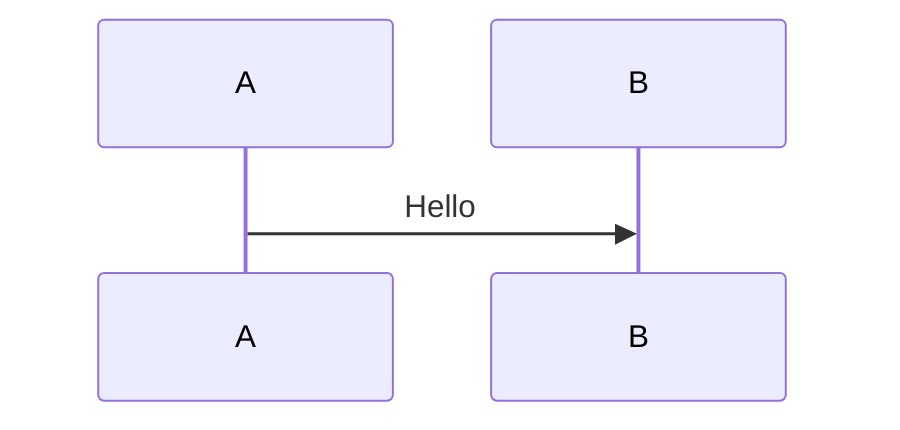

# Two Diagrams

The first diagram parses.

```mermaid
sequenceDiagram
    A->>B: Hello
```

The second diagram breaks on its third line.

```mermaid
sequenceDiagram
    participant A as Alpha
    A->>: Hello
```
